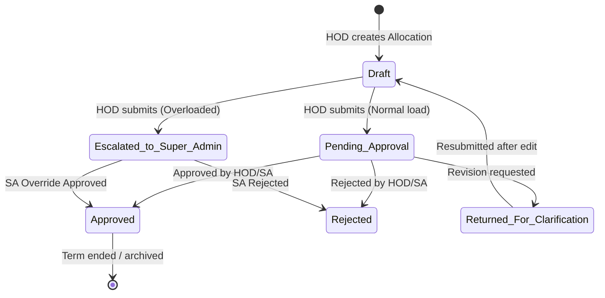

# Product Requirement Document (PRD)
# Paperless SOET — Faculty Workload Management System (FWMS)

**Document Version:** 1.0.0  
**Project Name:** Paperless SOET — Faculty Workload Management System (FWMS)  
**Target Organization:** MGM University (School of Engineering & Technology - SOET)  
**Document Status:** Approved / Production-Ready  
**Last Updated:** August 2026  

---

## 1. Executive Summary & Vision

### 1.1 Executive Summary
The **Paperless SOET — Faculty Workload Management System (FWMS)** is a modern, enterprise-grade academic workload distribution and governance platform. Historically, academic institutions rely on paper forms, static spreadsheets, and manual calculations to distribute teaching hours across faculty. This legacy process leads to allocation errors, double-booked lab/theory slots, untracked overload/underload conditions, delayed approvals, and high administrative burden.

FWMS digitizes, automates, and optimizes the entire academic workload workflow. It introduces automated workload calculations, real-time institutional policy enforcement, multi-tier approval state machines with SLA escalations, multi-role analytics dashboards, and an AI-driven document ingestion pipeline powered by Google Gemini.

### 1.2 Vision Statement
To transform MGM University SOET into a paperless, transparent, and data-driven academic institution where faculty workload is allocated equitably, audited continuously, and managed seamlessly.

---

## 2. Product Objectives & Target Metrics

### 2.1 Strategic Objectives
1. **Eliminate Paper-Based Distribution:** 100% digital submission, review, and approval of teaching workloads across all SOET departments.
2. **Ensure Institutional Compliance:** Enforce academic norms (minimum/maximum teaching hours per designation) and eliminate human errors in weekly hour calculations.
3. **Prevent Scheduling Conflicts:** Guarantee zero double-bookings of class divisions or lab batches.
4. **Accelerate Workload Ingestion:** Reduce historical paper workload import time from days to seconds using AI-powered document extraction.
5. **Streamline Approvals:** Provide automated SLA tracking and escalation for pending allocations to prevent administrative bottlenecks.

### 2.2 Key Performance Indicators (KPIs)
* **Allocation Error Rate:** 0% double-bookings and 0% calculation discrepancies.
* **Approval Cycle Time:** Under 48 hours average turn-around time for HOD submissions.
* **Ingestion Efficiency:** >90% reduction in time required to import seasonal workload sheets via Gemini AI ingestion.
* **Audit Transparency:** 100% traceability for all workload revisions, overrides, and approvals.

---

## 3. User Personas & Access Roles

| Role | Target User | Key Responsibilities & Permissions |
| :--- | :--- | :--- |
| **Super Admin (SA)** | Dean, Academic Head, Central Registrar | System-wide control. Manages schools, departments, academic terms, master workload norms per designation. Has exclusive authority to override overloaded workloads and resolve SLA escalations. |
| **Department Admin / HOD** | Head of Department | Manages department-level faculty, subjects, class divisions, and lab batches. Creates, submits, and adjusts faculty teaching allocations and student strength records. |
| **Faculty** | Professors, Associate Professors, Asst. Professors, Contract/Visiting Staff | Views personal teaching load, assigned subjects, division/batch schedules, and tracks request/approval status through a dedicated dashboard. |

---

## 4. System Architecture & Tech Stack

```text
/Paperless SOET
├── DESIGN.md                     # Ventriloc UI theme guidelines
├── variables.css                 # CSS Custom Properties for design system tokens
├── theme.css                     # Global utility CSS classes
├── tokens.json                   # Raw theme tokens
└── fwms/                         # Monorepo workspace
    ├── apps/
    │   ├── api/                  # Express.js + Prisma ORM (Backend API)
    │   └── web/                  # Next.js 16 App Router + Zustand (Frontend)
    └── packages/
        └── shared/               # Shared TypeScript types, schemas & enums
```

* **Monorepo Management:** `npm workspaces` with TypeScript across all apps and packages.
* **Backend API:** Node.js + Express.js with Prisma ORM and SQLite (dev) / PostgreSQL (prod).
* **Frontend Application:** Next.js 16 (App Router), Zustand (State Management), Recharts (Visualizations), Lucide Icons.
* **AI Integration:** Google Gemini 2.5 Flash API via `@google/generative-ai` SDK.
* **Authentication:** Dual JWT (Short-lived Access Token + Secure `httpOnly` Refresh Cookie).

---

## 5. Functional Requirements (FR)

### Module 1: Master Data Management
* **FR-1.1 (School & Department Management):** System shall support multi-school hierarchy, allowing Super Admins to define schools and sub-departments with custom default lab batch sizes.
* **FR-1.2 (Academic Term Control):** Support active vs. archived academic terms (e.g., "2026-27, Term 1"). Only one term can be active per school context at any given time.
* **FR-1.3 (Faculty Profiles):** Maintain comprehensive faculty records including Designation (`Professor`, `Associate Professor`, `Assistant Professor`), Employment Type (`Permanent`, `Contract`, `Visiting`), department affiliation, and security status.
* **FR-1.4 (Subject Master):** Support course definition with credit hours, theory/practical/tutorial flags, and custom hour calculation multipliers.
* **FR-1.5 (Class & Batch Management):** Define student class divisions (e.g., TE Div A) and dynamic lab batch splits (e.g., Batches B1, B2, B3) derived from student strength.

### Module 2: Workload Calculation & Norms Engine
* **FR-2.1 (Theory Hour Formula):** Compute theory hours as:
  $$\text{Theory Hours} = \text{Credit Hours} \times \text{Theory Multiplier}$$
* **FR-2.2 (Practical Hour Formula):** Compute practical hours per batch as:
  $$\text{Practical Hours} = \text{Credit Hours} \times \text{Practical Multiplier} \times \text{Batch Count}$$
* **FR-2.3 (Workload Norms Rule):** Admin-configurable weekly hour bands per designation (e.g., Asst. Professor: Min 14 hrs, Max 18 hrs).
* **FR-2.4 (Dynamic Recalculation):** Any change to subject credit multipliers must automatically recalculate all active allocations linked to that subject.

### Module 3: Conflict & Constraint Resolution Engine
* **FR-3.1 (Double-Booking Validation):** Hard constraint preventing assignment of the same class division or batch for a given subject to multiple faculty members in the same term (`409 Conflict`).
* **FR-3.2 (Overload Detection & Escalation):** If proposed allocation causes total weekly hours to exceed `maxWeeklyHours`:
  * System flags allocation: `requiresSaOverride = true`.
  * Status set to `escalated_to_super_admin`.
  * HOD cannot self-approve overloaded allocations.
* **FR-3.3 (Underload Warning):** Soft alert when projected load falls below `minWeeklyHours`, prompting HOD to assign additional duties or tutorials.

### Module 4: Allocation Lifecycle & Approval State Machine


* **FR-4.1 (State Management):** Support draft creation, review, return for clarification, rejection, and approval.
* **FR-4.2 (Automated Daily SLA Escalation Cron):** Daily midnight background job scans allocations pending approval longer than `slaDaysForHodReview` (default: 3 days). Overdue pending allocations automatically escalate to Super Admin status with escalation logs.

### Module 5: AI-Powered Workload Sheet Ingestion
* **FR-5.1 (Document Ingestion):** Support upload of physical workload sheets (PDF, PNG, JPEG, WEBP up to 20MB).
* **FR-5.2 (Gemini 2.5 Flash Integration):** Parse unstructured tabular workload sheets into strict JSON payloads matching `WorkloadReport` and `WorkloadReportRow` database models.
* **FR-5.3 (Dry-Run Mode):** Option to run preview ingestion without DB commitment, displaying parsed tables to HOD for verification.
* **FR-5.4 (Batch Persistence):** Commit ingested rows into structural reports for reporting and quick allocation seeding.

### Module 6: Role-Specific Dashboards & Analytics
* **FR-6.1 (Super Admin Dashboard):**
  * Institutional aggregate metrics (Total Faculty, Active Allocations, Overload Count).
  * Stacked Bar Chart (Theory vs. Practical hours distribution across departments).
  * Workload Heatmap Grid (Color-coded indicators: Green = Normal, Yellow = Underload, Orange/Red = Overloaded).
* **FR-6.2 (HOD Dashboard):**
  * Department summary cards.
  * Course Distribution Donut Chart.
  * Faculty Workload table with instant allocation & approval controls.
* **FR-6.3 (Faculty Dashboard):**
  * Radial Progress Gauge showing individual weekly hours vs. designation limit.
  * Detailed schedule card list of assigned subjects, divisions, and batches.
  * Vertical audit log timeline showing status updates on recent allocation requests.

### Module 7: Security, Authentication & Auditability
* **FR-7.1 (Dual JWT Auth):** Short-lived Access Token (15-min, memory-stored) + Long-lived Refresh Token (7-day, `httpOnly`, `sameSite: strict` cookie).
* **FR-7.2 (Silent Token Refresh):** Frontend client automatically intercepts `401 Unauthorized` responses, invokes `/auth/refresh`, and seamlessly replays queued API requests without user interruption.
* **FR-7.3 (Role-Based Access Control):** Gated API endpoints based on roles (`super_admin`, `dept_admin`, `faculty`) and departmental scoping (`requireDeptScope`).
* **FR-7.4 (Comprehensive Audit Logs):** Full tracking of authentication attempts, lockouts, password resets, allocation revisions, and SA override approvals.

---

## 6. Non-Functional Requirements (NFR)

| Metric | Requirement |
| :--- | :--- |
| **Performance** | API responses <200ms for standard requests; <3s for Gemini AI document parsing. |
| **Scalability** | Designed to handle multi-school campus workloads with hundreds of faculty members and thousands of allocations. |
| **Security** | Zero-trust RBAC middleware, bcrypt password hashing (min 10 rounds), token rotation, rate-limiting on sensitive auth routes. |
| **Reliability** | Atomic database transactions for multi-row allocation batch creation and schema integrity guarantees. |
| **Usability & Theme** | Modern "Ventriloc" design system (Mist `#efefef` background, Paper `#ffffff` surfaces, Carbon `#202020` text, Signal Orange `#ff682c` accent typography). |

---

## 7. UI/UX Design System Guidelines ("Ventriloc Theme")

* **Color Tokens:**
  * Background: `Mist` (`#efefef`)
  * Surface/Card: `Paper` (`#ffffff`)
  * Primary Text: `Carbon` (`#202020`)
  * Secondary Text: `Graphite` (`#4d4d4d`)
  * Chromatic Accent: `Signal Orange` (`#ff682c`) — reserved for branding accents, active navigation states, and metric alert indicators.
* **Typography:**
  * Headers: PolySans / Architectural Sans (Condensed display style).
  * Body & Controls: Inter (Clean geometric sans-serif).
* **Component Styling:**
  * Cards: $8\text{px}$ border radius, subtle border strokes (`#e0e0e0`).
  * Buttons: $20\text{px}$ pill-shaped controls with crisp hover micro-animations.
  * Floating Nav: $200\text{px}$ capsule styling for top header controls.

---

## 8. Release & Deployment Roadmap

1. **Phase 1 (Core Platform & Auth):** Monorepo architecture setup, Prisma DB schema, Dual JWT Auth engine, RBAC middleware. *(Completed)*
2. **Phase 2 (Workload & Conflict Engine):** Master data CRUD, hour multipliers, double-booking validation, overload detection engine. *(Completed)*
3. **Phase 3 (Approval State Machine & SLA Cron):** Multi-stage allocation lifecycle, audit log integration, automated daily SLA escalation background worker. *(Completed)*
4. **Phase 4 (AI Document Ingestion):** Gemini 2.5 Flash OCR pipeline integration, structured JSON parser, dry-run & preview interface. *(Completed)*
5. **Phase 5 (Dashboards & Design Polish):** Recharts visualization suite (Radial Gauge, Donut Chart, Stacked Bar Chart, Heatmap), Ventriloc theme implementation. *(Completed)*

---

## 9. Verification & Acceptance Criteria

To deem FWMS ready for deployment, the following checks must be satisfied:
* [x] Database migration executes cleanly (`npm run db:migrate`).
* [x] System seed script successfully populates default roles, super admin, sample department, and faculty (`npm run db:seed`).
* [x] Double-booking an identical division/batch returns `409 Conflict`.
* [x] Assigning hours above designation max flags allocation for Super Admin override.
* [x] Silent refresh cycle handles expired access tokens without signing the user out.
* [x] Gemini AI ingestion parses uploaded workload images/PDFs into structured table rows cleanly.
