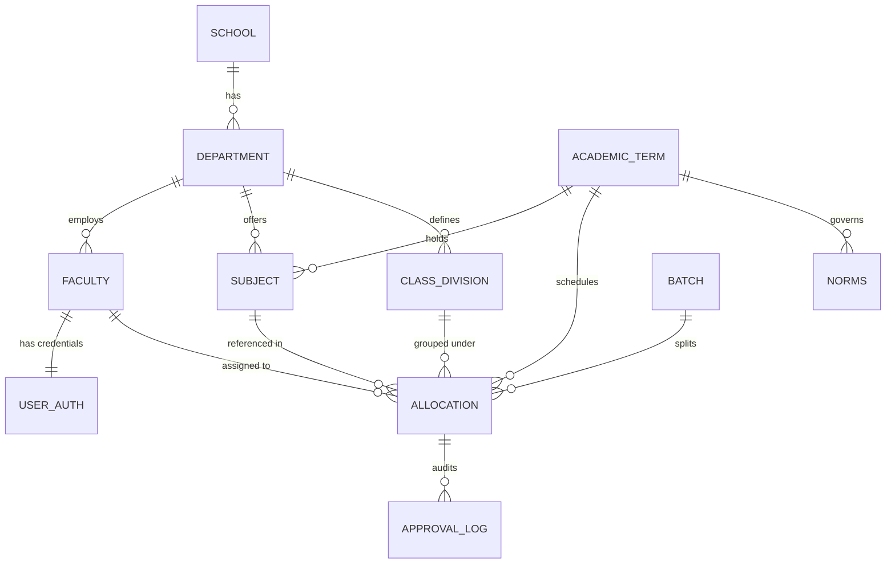
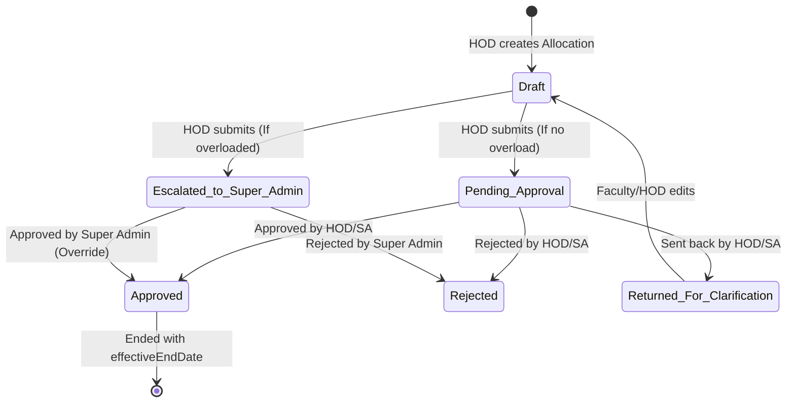

# Paperless SOET — Faculty Workload Management System (FWMS)
## Architectural & Implementation Overview

This document provides a complete, context-rich overview of the **Paperless SOET — Faculty Workload Management System (FWMS)** developed for MGM University (specifically the School of Engineering and Technology). This explainer is optimized for consumption by human engineers, external AI models (like NotebookLM), and developers seeking to understand the entire system's design, workflows, and configuration.

---

## 1. High-Level System Concept

FWMS is a campus-wide, multi-role web platform designed to eliminate paper-based teaching workload distribution processes. It allows administrators to define academic terms, workload norms per academic role, subjects, class divisions, and practical batches. It automates the calculation of weekly teaching hours, enforces department boundaries and role-based policies, dynamically flags workload issues (underload/overload), checks for double-bookings, and automates document ingestion using Gemini AI.

### Core User Roles
1. **Super Admin (SA):** Full system control. Manages schools, departments, academic terms, and master workload norms. Handles manual overrides of overloaded schedules and processes escalated approvals.
2. **Department Admin / HOD (Head of Department):** Manages faculty lists, subjects, classes, and batches for their department. Creates, updates, and submits faculty teaching allocations and student strength records for approval.
3. **Faculty:** Standard teaching staff. Logs in to view their assigned workload, teaching schedule, and historical change requests/approvals via a personal dashboard.

---

## 2. Technology Stack & Monorepo Structure

The project is structured as a monorepo using **npm workspaces**, written entirely in **TypeScript**.

### Directory Layout
```text
/Paperless SOET
├── DESIGN.md                     # Ventriloc design/UI theme guidelines
├── variables.css                 # CSS Custom Properties for design system tokens
├── theme.css                     # Global utility css classes
├── tokens.json                   # Raw theme tokens
└── fwms/                         # Main workspace directory
    ├── REQUIREMENTS.md           # Prerequisites & run guidelines
    ├── package.json              # Monorepo configuration and scripts
    ├── apps/
    │   ├── api/                  # Express.js Backend API
    │   │   ├── prisma/           # Database schema & migrations (SQLite)
    │   │   │   └── schema.prisma
    │   │   └── src/
    │   │       ├── server.ts     # API entry point & middleware mounting
    │   │       ├── cron/         # Background cron jobs (SLA escalations)
    │   │       ├── lib/          # Prisma Client, Logger, JWT helpers
    │   │       ├── middleware/   # Authentication, role gating, error handlers
    │   │       └── modules/      # Business logic split by domain modules
    │   └── web/                  # Next.js Frontend Web App (App Router)
    │       └── src/
    │           ├── app/          # Protected and public route layouts/pages
    │           ├── components/   # UI elements and dashboards (Recharts, etc.)
    │           ├── lib/          # Custom API HTTP Client with token refreshing
    │           └── stores/       # Zustand client-side stores (Auth)
    └── packages/
        └── shared/               # Shared TypeScript schemas, enums, & validation
```

---

## 3. Database Schema & Data Models

FWMS uses **SQLite** in development, managed through **Prisma ORM**. Below are the main tables and relationships modeled in `schema.prisma`:



### Models Detailed Breakdown

*   **`School`:** Top-level institutional units (e.g., "School of Engineering & Technology") grouping departments.
*   **`Department`:** Academic units (e.g., "Civil Engineering") headed by an HOD (`Faculty`). Has a `defaultBatchSize` for practicals.
*   **`AcademicTerm`:** Tracks year and semester terms (e.g., "2026-27, Part 1") with `active` or `archived` statuses.
*   **`Faculty`:** Master table for teaching staff, recording their `Designation` (Professor, Associate Professor, Assistant Professor), `deptId`, and `EmploymentType` (Permanent, Contract, Visiting).
*   **`UserAuth`:** Login credentials linked to a `Faculty` profile. Stores `role` (`super_admin`, `dept_admin`, `faculty`), password hashes, and security logs (`failedLoginAttempts`, `lockedUntil`, `mustChangePassword`).
*   **`Subject`:** Course records containing credit hours, theory/practical/tutorial multipliers, and flags (`hasTheory`, `hasPractical`, `hasTutorial`).
*   **`Norms`:** Term-specific workload definitions per `Designation`. Specifies `minWeeklyHours`, `maxWeeklyHours`, default multipliers, and HOD review SLAs.
*   **`ClassDivision`:** Represents a specific section/division of a program (e.g., "TE (I) CE - Div A").
*   **`StudentStrength`:** Records class count per subject and term, subject to HOD/SA approval.
*   **`Batch`:** Practical sub-groups created under a theory class (e.g., Batch B1).
*   **`Allocation`:** Core record mapping a faculty member to a subject, class, and/or batch for a specific term. Stores computed hours (`theoryHours`, `practicalHours`, `totalHours`) and statuses.
*   **`ApprovalLog`:** Audit trails tracking allocations, student strengths, or batch changes as they transition statuses.
*   **`Notification`:** System notifications pushed to users.
*   **`AuditLog`:** Tracks authentication attempts and security-sensitive events.
*   **`WorkloadReport` & `WorkloadReportRow`:** Snapshots of a department's aggregated teaching workload, dynamically compiled for export and presentation.

---

## 4. Authentication, Authorization, & Security

### Double JWT Implementation
FWMS implements a secure token architecture to prevent common attack vectors:
1.  **Access Token:** Short-lived JSON Web Token (expiry: 15 minutes) passed in-memory in client state. Set as a `Bearer` header in API requests.
2.  **Refresh Token:** Long-lived JWT (expiry: 7 days) stored in a secure, `httpOnly`, `sameSite: strict` cookie. Used exclusively to obtain new Access Tokens.

### Client-Side Silent Refresh
The custom frontend `apiClient` (`apps/web/src/lib/api-client.ts`) intercepts requests. If an API call fails with `401 Unauthorized` (Token Expired), the client pauses outgoing requests, initiates a `/auth/refresh` request, stores the new Access Token, and replays all queued requests seamlessly.

### Role-Based Access Control (RBAC)
Routes on the backend are protected using Express middleware:
*   **`authenticate`:** Verifies the access token and attaches the decoded payload to the request (`req.user`).
*   **`requireRole(...roles)`:** Gates routes, restricting them only to specified roles (e.g., `/schools` restricted to `super_admin`).
*   **`requireDeptScope`:** Restricts Department Admins (HODs) to querying and writing data *only* for their assigned department ID.
*   **`requireSelfOrAdmin`:** Restricts Faculty users to viewing only their own profiles, while allowing HODs and Super Admins to view them.

---

## 5. Core Business Logic Engines

### A. Workload Engine (`apps/api/src/modules/workload-engine/service.ts`)
Calculates teaching hours based on the subject configuration:
*   **Theory Hours:** Evaluated at class level: $\text{Theory Hours} = \text{Credit Hours} \times \text{Theory Multiplier}$ (Only when no batch is specified).
*   **Practical Hours:** Evaluated at batch level: $\text{Practical Hours} = \text{Credit Hours} \times \text{Practical Multiplier} \times \text{Number of Batches}$ (Where number of batches is typically 1 per allocation row).
*   **Tutorial Hours:** Derived from `tutorialHours` times the batch count, or mapped directly if class-wide.
*   **Total Weekly Hours:** The sum of theory, practical, and tutorial hours allocated.
*   **Recalculation:** Subject multipliers changes trigger an automatic recalculation of hours across all linked allocations for that term.

### B. Conflict Engine (`apps/api/src/modules/conflict-engine/service.ts`)
Enforces two major institutional constraints during allocation updates:
1.  **Double-Booking Check (Hard Constraint):** Ensures that a specific class division or laboratory batch is not assigned to more than one faculty member for the same subject in the active term. Attempting this throws a `409 Conflict` error.
2.  **Workload Norms Check (Soft/Escalated Constraint):** Calculates the faculty member's projected workload:
    $$\text{Projected Workload} = \text{Current Weekly Hours} + \text{New Allocation Hours}$$
    It compares this value against the `Norms` configuration (`minWeeklyHours` and `maxWeeklyHours`) for the faculty's academic designation.
    *   **Underload:** Projected workload is below `minWeeklyHours`.
    *   **Overload:** Projected workload exceeds `maxWeeklyHours`. If overloaded, the allocation is flagged with `requiresSaOverride = true` and `status = 'draft'`. It can only be approved by a Super Admin.

---

## 6. Allocation Lifecycle & Workflows



### Background SLA Escalation (`apps/api/src/cron/sla-escalation.ts`)
A cron job runs **daily at midnight**. It checks all allocations remaining in `pending_approval` status.
*   It looks up the submitted date and checks it against the designation's `slaDaysForHodReview` (defaulting to 3 days).
*   If the pending duration exceeds the SLA, the system automatically marks the allocation with `requiresSaOverride = true` and creates an escalation log, notifying the Super Admin to intervene.

---

## 7. AI-Powered Workload Ingestion

FWMS implements a document parser using the **Gemini 2.5 Flash API** to ingest physical workload sheets (scans or PDFs).

### Processing Flow (`apps/api/src/modules/workload-report/routes.ts`)
1.  **Upload:** HOD or Super Admin uploads a document (up to 20MB, supported: JPEG, PNG, WEBP, PDF) via `POST /workload-report/ingest`.
2.  **AI Extraction:** The backend reads the file buffer, converts it to base64, and passes it to the `gemini-2.5-flash` model using the `@google/generative-ai` SDK.
3.  **Prompt Instruction:** The prompt enforces strict structured rules to map columns to structured JSON schema (normalizing designations and appointment types).
4.  **Dry-Run Mode:** If `dryRun=true` is requested, the API returns the parsed schema as a visual preview without committing it to the database.
5.  **Persistence:** If committed, the system checks if a `WorkloadReport` exists for the department and term. It translates the extracted subjects into `WorkloadReportRow` records, replacing any existing ones.

---

## 8. Frontend Navigation, State, & UI Dashboards

The client application is built with **Next.js 16** and uses **Zustand** for authentication state management. 

### Visual Guidelines: The "Ventriloc" Theme
FWMS adheres to the *Ventriloc* design guidelines (detailed in `DESIGN.md`), featuring:
*   **Colors:** An elegant, flat light-mode palette. Canvas background in Mist (`#efefef`), content surfaces in Paper (`#ffffff`), and text in Carbon (`#202020`) and Graphite (`#4d4d4d`).
*   **Aesthetic Spark:** A single chromatic accent — **Signal Orange (`#ff682c`)** — used exclusively for branding highlights, charts, and metric alerts (e.g. overloaded states).
*   **Typography:** Displays and headers in PolySans (condensed, architectural sans-serif) at tight line-heights ($0.91$). Body text in Inter.
*   **Borders:** Soft, modern rounding ($8\text{px}$ for cards/inputs, $20\text{px}$ for pill-shaped buttons, $200\text{px}$ for floating navigation capsules).

### Dashboard Analytics Components (`apps/web/src/components/dashboard/`)
1.  **Faculty Dashboard:** Features a **Radial Progress Gauge** (from Recharts) representing workload hours relative to limits, an assigned subject directory, and a vertical timeline tracking recent request status.
2.  **HOD Dashboard:** Summarizes department metrics (total faculty, average department workload, number of overloaded staff) and shows a **Pie/Donut Chart** detailing hour allocations across courses.
3.  **Super Admin Dashboard:** Synthesizes metrics across all departments using a stacked **Bar Chart** (Theory vs. Practical hours per department) and a **Heatmap Grid** showing individual faculty loads (green = normal, yellow = underloaded, orange/red = overloaded).

---

## 9. Local Setup & Execution Guide

Refer to `fwms/REQUIREMENTS.md` for environmental dependencies:
1.  **Environment Configuration:** Copy/rename `.env.example` to `.env` in the `fwms/` root and populate database, JWT secrets, and logging levels.
2.  **Install Dependencies:** Run `npm install` in the `fwms/` directory.
3.  **Database Migration & Seeding:**
    ```bash
    npm run db:migrate  # Pushes Prisma schema and creates dev.db SQLite database
    npm run db:seed     # seeds super_admin (admin/admin) and mockup institutional data
    ```
4.  **Launch Dev Servers:** Execute `npm run dev` to launch the API on port `4000` and the web app on port `3000` concurrently.
